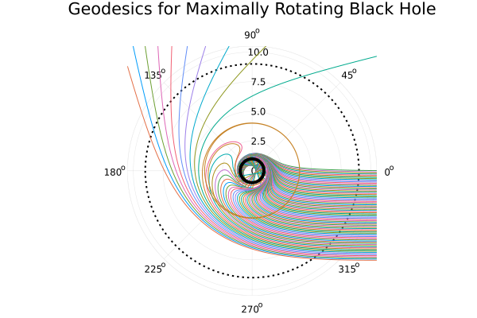

# Integration

All of the integration problems are solved using [DifferentialEquations.jl](https://diffeq.sciml.ai/stable/).

## Gallery

Integrating geodesic curves:




## Methods

All geodesics are light-like, starting at $t=0$, $r=1000$ orientated towards the black hole.

The integrator defines a chart 

```julia
function chartbounds(u, params, t)
    t, r, θ, ϕ = u[1:4]
    on_chart = event_horizon < r < effective infinity
    !on_chart
end
```

which interrupts the integration when the geodesic leaves the local spacetime.

After each step, the sign of $V_r$ and $V_\theta$ is checked, and flipped if needed.

```@docs
calcgeodesic
integrategeodesic
```

## Configuration

We distinguish between two common problem types

- those where the geodesic paths are desired
- those where the collision points of the geodesics are desired

This is done for performance; the memory overhead of the later can be far reduced by not storing intermediate values in the integration process.

Internally, these are differentiated through the keyword parameter `save_geodesics` in [`calcgeodesic`](@ref) or passed to an `IntegratorConfig`:

The integration problems and solvers are configured through subtypes of `IntegratorConfig`. These are:

```@docs
GeodesicTracer.IntegratorConfig
SingleParams
ParallelParams
```

## Internal methods

The integration problems themselves are given as:

```@docs
rayintegrator
rayintegrator!
```

The paths of the geodesics are monitored for the effective potential signs flips by:

```@docs 
GeodesicTracer.signflip
GeodesicTracer.wrapcallback
```

Internally, the helper methods for ensemble renderings are:

```@docs
GeodesicTracer.newparams
```

## Internal types

```@docs
GeodesicTracer.GeodesicParams
GeodesicTracer.flip_rsign
GeodesicTracer.flip_θsign
GeodesicTracer.changetype
```